# Deco CMS Operator Architecture

This document provides visual diagrams and architectural overview of the Deco CMS Operator.

## Complete System Flow

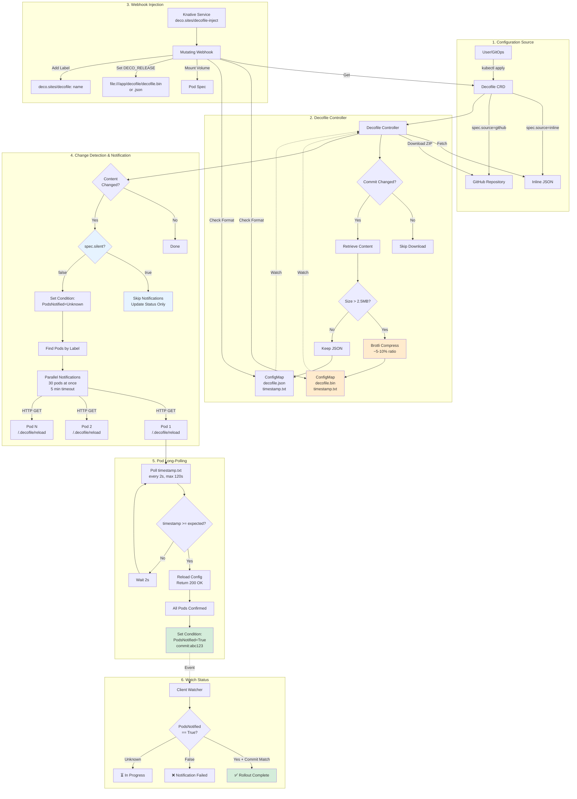
```mermaid
flowchart TB
    subgraph "1. Configuration Source"
        User[User/GitOps] -->|kubectl apply| Decofile[Decofile CRD]
        Decofile -->|spec.source=inline| Inline[Inline JSON]
        Decofile -->|spec.source=github| GitHub[GitHub Repository]
    end

    subgraph "2. Decofile Controller"
        Decofile --> Controller[Decofile Controller]
        Controller -->|Fetch| Inline
        Controller -->|Download ZIP| GitHub
        Controller --> Cache{Commit Changed?}
        Cache -->|No| Skip[Skip Download]
        Cache -->|Yes| Retrieve[Retrieve Content]
        Retrieve --> Size{Size > 2.5MB?}
        Size -->|Yes| Compress[Brotli Compress<br/>~5-10% ratio]
        Size -->|No| NoCompress[Keep JSON]
        Compress --> BinCM[ConfigMap<br/>decofile.bin<br/>timestamp.txt]
        NoCompress --> JsonCM[ConfigMap<br/>decofile.json<br/>timestamp.txt]
    end

    subgraph "3. Webhook Injection"
        KService[Knative Service<br/>deco.sites/decofile-inject] --> Webhook[Mutating Webhook]
        Webhook -->|Get| Decofile
        Webhook -->|Check Format| BinCM
        Webhook -->|Check Format| JsonCM
        Webhook -->|Mount Volume| PodSpec[Pod Spec]
        Webhook -->|Set DECO_RELEASE| EnvVar[file:///app/decofile/decofile.bin<br/>or .json]
        Webhook -->|Add Label| PodLabel[deco.sites/decofile: name]
    end

    subgraph "4. Change Detection & Notification"
        BinCM -.->|Watch| Controller
        JsonCM -.->|Watch| Controller
        Controller --> Changed{Content<br/>Changed?}
        Changed -->|No| Done1[Done]
        Changed -->|Yes| Silent{spec.silent?}
        Silent -->|true| SkipNotify[Skip Notifications<br/>Update Status Only]
        Silent -->|false| SetInProgress[Set Condition:<br/>PodsNotified=Unknown]
        SetInProgress --> FindPods[Find Pods by Label]
        FindPods --> Parallel[Parallel Notifications<br/>30 pods at once<br/>5 min timeout]
        Parallel -->|HTTP GET| Pod1[Pod 1<br/>/.decofile/reload]
        Parallel -->|HTTP GET| Pod2[Pod 2<br/>/.decofile/reload]
        Parallel -->|HTTP GET| PodN[Pod N<br/>/.decofile/reload]
    end

    subgraph "5. Pod Long-Polling"
        Pod1 --> LongPoll1[Poll timestamp.txt<br/>every 2s, max 120s]
        LongPoll1 --> Check1{timestamp >= expected?}
        Check1 -->|Yes| Reload1[Reload Config<br/>Return 200 OK]
        Check1 -->|No| Wait1[Wait 2s] --> LongPoll1
        
        Reload1 --> Success[All Pods Confirmed]
        Success --> UpdateCondition[Set Condition:<br/>PodsNotified=True<br/>commit:abc123]
    end

    subgraph "6. Watch Status"
        UpdateCondition -.->|Event| Watcher[Client Watcher]
        Watcher --> CheckCondition{PodsNotified<br/>== True?}
        CheckCondition -->|Yes + Commit Match| ClientSuccess[✅ Rollout Complete]
        CheckCondition -->|False| ClientFail[❌ Notification Failed]
        CheckCondition -->|Unknown| ClientWait[⏳ In Progress]
    end

    style Compress fill:#ffebcd
    style BinCM fill:#ffebcd
    style Silent fill:#e6f3ff
    style SkipNotify fill:#e6f3ff
    style UpdateCondition fill:#d4edda
    style ClientSuccess fill:#d4edda
```

## Detailed Component Flows

### Flow 1: Inline Source

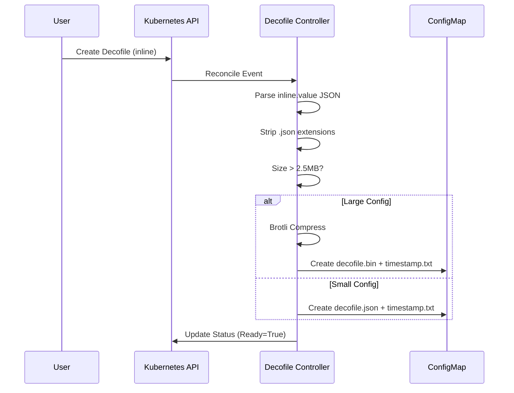
```mermaid
sequenceDiagram
    participant User
    participant K8s as Kubernetes API
    participant Ctrl as Decofile Controller
    participant CM as ConfigMap

    User->>K8s: Create Decofile (inline)
    K8s->>Ctrl: Reconcile Event
    Ctrl->>Ctrl: Parse inline.value JSON
    Ctrl->>Ctrl: Strip .json extensions
    Ctrl->>Ctrl: Size > 2.5MB?
    alt Large Config
        Ctrl->>Ctrl: Brotli Compress
        Ctrl->>CM: Create decofile.bin + timestamp.txt
    else Small Config
        Ctrl->>CM: Create decofile.json + timestamp.txt
    end
    Ctrl->>K8s: Update Status (Ready=True)
```

### Flow 2: GitHub Source with Caching

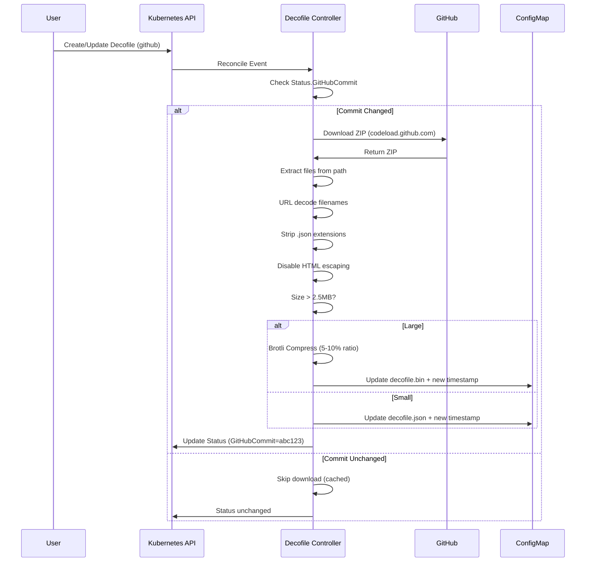
```mermaid
sequenceDiagram
    participant User
    participant K8s as Kubernetes API
    participant Ctrl as Decofile Controller
    participant GH as GitHub
    participant CM as ConfigMap

    User->>K8s: Create/Update Decofile (github)
    K8s->>Ctrl: Reconcile Event
    Ctrl->>Ctrl: Check Status.GitHubCommit
    
    alt Commit Changed
        Ctrl->>GH: Download ZIP (codeload.github.com)
        GH->>Ctrl: Return ZIP
        Ctrl->>Ctrl: Extract files from path
        Ctrl->>Ctrl: URL decode filenames
        Ctrl->>Ctrl: Strip .json extensions
        Ctrl->>Ctrl: Disable HTML escaping
        Ctrl->>Ctrl: Size > 2.5MB?
        alt Large
            Ctrl->>Ctrl: Brotli Compress (5-10% ratio)
            Ctrl->>CM: Update decofile.bin + new timestamp
        else Small
            Ctrl->>CM: Update decofile.json + new timestamp
        end
        Ctrl->>K8s: Update Status (GitHubCommit=abc123)
    else Commit Unchanged
        Ctrl->>Ctrl: Skip download (cached)
        Ctrl->>K8s: Status unchanged
    end
```

### Flow 3: Webhook Injection

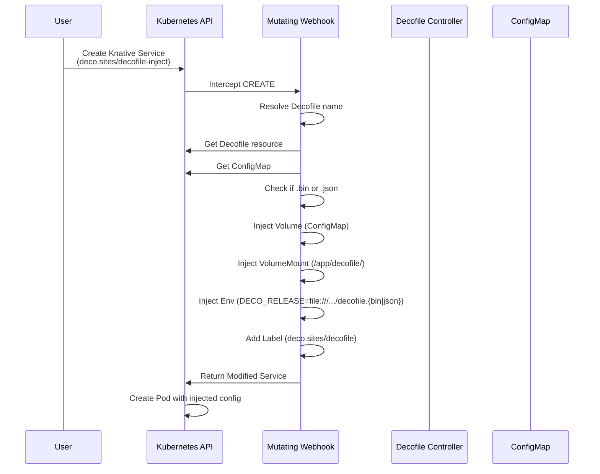
```mermaid
sequenceDiagram
    participant User
    participant K8s as Kubernetes API
    participant Webhook as Mutating Webhook
    participant Ctrl as Decofile Controller
    participant CM as ConfigMap

    User->>K8s: Create Knative Service<br/>(deco.sites/decofile-inject)
    K8s->>Webhook: Intercept CREATE
    Webhook->>Webhook: Resolve Decofile name
    Webhook->>K8s: Get Decofile resource
    Webhook->>K8s: Get ConfigMap
    Webhook->>Webhook: Check if .bin or .json
    Webhook->>Webhook: Inject Volume (ConfigMap)
    Webhook->>Webhook: Inject VolumeMount (/app/decofile/)
    Webhook->>Webhook: Inject Env (DECO_RELEASE=file:///.../decofile.{bin|json})
    Webhook->>Webhook: Add Label (deco.sites/decofile)
    Webhook->>K8s: Return Modified Service
    K8s->>K8s: Create Pod with injected config
```

### Flow 4: Change Notification (Non-Silent)

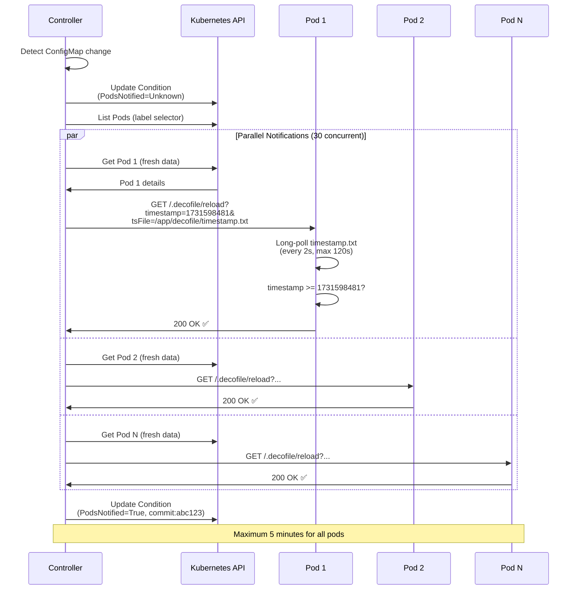
```mermaid
sequenceDiagram
    participant Ctrl as Controller
    participant K8s as Kubernetes API
    participant Pod1 as Pod 1
    participant Pod2 as Pod 2
    participant PodN as Pod N

    Ctrl->>Ctrl: Detect ConfigMap change
    Ctrl->>K8s: Update Condition<br/>(PodsNotified=Unknown)
    Ctrl->>K8s: List Pods (label selector)
    
    par Parallel Notifications (30 concurrent)
        Ctrl->>K8s: Get Pod 1 (fresh data)
        K8s->>Ctrl: Pod 1 details
        Ctrl->>Pod1: GET /.decofile/reload?<br/>timestamp=1731598481&<br/>tsFile=/app/decofile/timestamp.txt
        Pod1->>Pod1: Long-poll timestamp.txt<br/>(every 2s, max 120s)
        Pod1->>Pod1: timestamp >= 1731598481?
        Pod1->>Ctrl: 200 OK ✅
    and
        Ctrl->>K8s: Get Pod 2 (fresh data)
        Ctrl->>Pod2: GET /.decofile/reload?...
        Pod2->>Ctrl: 200 OK ✅
    and
        Ctrl->>K8s: Get Pod N (fresh data)
        Ctrl->>PodN: GET /.decofile/reload?...
        PodN->>Ctrl: 200 OK ✅
    end
    
    Ctrl->>K8s: Update Condition<br/>(PodsNotified=True, commit:abc123)
    
    Note over Ctrl,PodN: Maximum 5 minutes for all pods
```

### Flow 5: Silent Mode

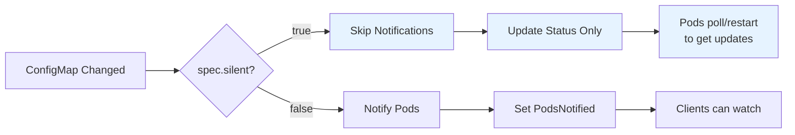
```mermaid
flowchart LR
    A[ConfigMap Changed] --> B{spec.silent?}
    B -->|true| C[Skip Notifications]
    C --> D[Update Status Only]
    D --> E[Pods poll/restart<br/>to get updates]
    
    B -->|false| F[Notify Pods]
    F --> G[Set PodsNotified]
    G --> H[Clients can watch]
    
    style C fill:#e6f3ff
    style D fill:#e6f3ff
    style E fill:#e6f3ff
```

### Flow 6: Watch Pattern (Race-Free)

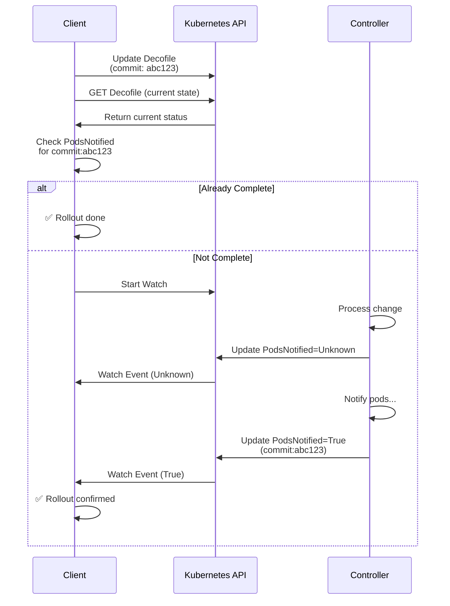
```mermaid
sequenceDiagram
    participant Client
    participant K8s as Kubernetes API
    participant Ctrl as Controller

    Client->>K8s: Update Decofile<br/>(commit: abc123)
    Client->>K8s: GET Decofile (current state)
    K8s->>Client: Return current status
    Client->>Client: Check PodsNotified<br/>for commit:abc123
    
    alt Already Complete
        Client->>Client: ✅ Rollout done
    else Not Complete
        Client->>K8s: Start Watch
        Ctrl->>Ctrl: Process change
        Ctrl->>K8s: Update PodsNotified=Unknown
        K8s->>Client: Watch Event (Unknown)
        Ctrl->>Ctrl: Notify pods...
        Ctrl->>K8s: Update PodsNotified=True<br/>(commit:abc123)
        K8s->>Client: Watch Event (True)
        Client->>Client: ✅ Rollout confirmed
    end
```

## Decofile Delivery: S3 Target (etcd Offload)

Content-heavy sites (many/large blocks — e.g. a blog with full-HTML posts inline)
can push the merged decofile's brotli+base64 size past the ~1MB etcd ConfigMap
ceiling, at which point the Kubernetes API server rejects the ConfigMap write and
the site can no longer publish. `spec.target: "s3"` is an **opt-in, per-site**
alternative: the operator uploads the decofile to S3 as plain JSON and points
pods at it over HTTP instead of mounting a ConfigMap. Fully reversible — flip
`target` back to `configmap` (the default) and the next reconcile reverts.

### Flow 7a: Cold Start (target=s3)

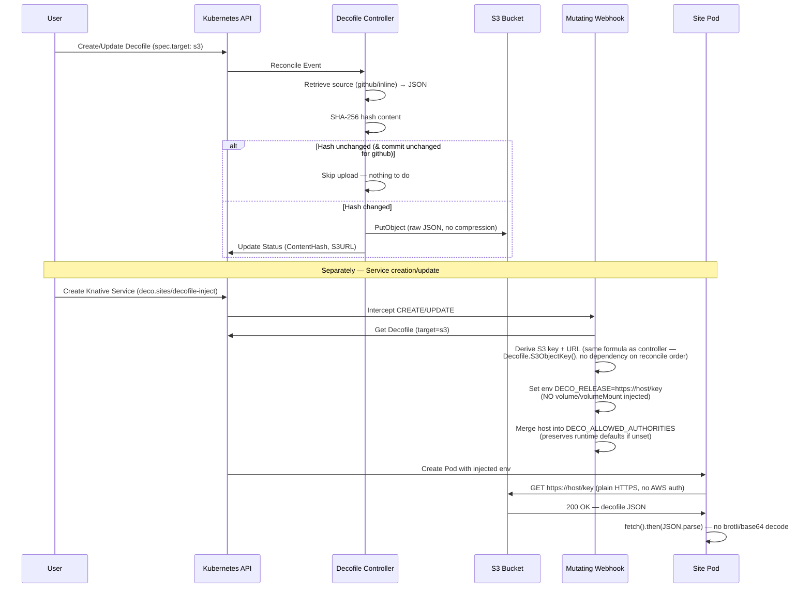
```mermaid
sequenceDiagram
    participant User
    participant K8s as Kubernetes API
    participant Ctrl as Decofile Controller
    participant S3 as S3 Bucket
    participant Webhook as Mutating Webhook
    participant Pod as Site Pod

    User->>K8s: Create/Update Decofile (spec.target: s3)
    K8s->>Ctrl: Reconcile Event
    Ctrl->>Ctrl: Retrieve source (github/inline) → JSON
    Ctrl->>Ctrl: SHA-256 hash content
    alt Hash unchanged (& commit unchanged for github)
        Ctrl->>Ctrl: Skip upload — nothing to do
    else Hash changed
        Ctrl->>S3: PutObject (raw JSON, no compression)
        Ctrl->>K8s: Update Status (ContentHash, S3URL)
    end

    Note over User,Pod: Separately — Service creation/update
    User->>K8s: Create Knative Service (deco.sites/decofile-inject)
    K8s->>Webhook: Intercept CREATE/UPDATE
    Webhook->>K8s: Get Decofile (target=s3)
    Webhook->>Webhook: Derive S3 key + URL (same formula as controller —<br/>Decofile.S3ObjectKey(), no dependency on reconcile order)
    Webhook->>Webhook: Set env DECO_RELEASE=https://host/key<br/>(NO volume/volumeMount injected)
    Webhook->>Webhook: Merge host into DECO_ALLOWED_AUTHORITIES<br/>(preserves runtime defaults if unset)
    K8s->>Pod: Create Pod with injected env
    Pod->>S3: GET https://host/key (plain HTTPS, no AWS auth)
    S3->>Pod: 200 OK — decofile JSON
    Pod->>Pod: fetch().then(JSON.parse) — no brotli/base64 decode
```

### Flow 7b: Hot Reload (target=s3)

Identical to **Flow 4** (Change Notification) — the s3 target reuses
`NotifyPodsForDecofile` unchanged. The only difference from the ConfigMap path
is *what* changed (an S3 object, not a ConfigMap) and that the reconciler
pushes the **uncompressed** JSON in the notify payload (same as it always has —
`NotifyPodsForDecofile` was never brotli-aware; compression is a ConfigMap-side
concern only). Pods that implement `/.decofile/reload` don't need to know which
target delivered their *next* update; only the *initial* fetch path (mounted
file vs. HTTP GET) differs.

### s3 vs configmap: what changes

| | `configmap` (default) | `s3` |
|---|---|---|
| Storage | ConfigMap key `decofile.bin` (brotli+base64) | S3 object (plain JSON) |
| Size ceiling | ~1MB (etcd) | none (S3 object limit is 5TB) |
| Cold start | Volume mount, `DECO_RELEASE=file://…` | HTTP env only, `DECO_RELEASE=https://…` |
| Change detection | ConfigMap data diff | SHA-256 content hash (`Status.ContentHash`) |
| Hot reload | `NotifyPodsForDecofile` (unchanged) | `NotifyPodsForDecofile` (unchanged) |
| GC | Owned by Decofile (owner ref) — cascades | **Not GC'd** — a deleted Decofile leaves its S3 object; rely on a bucket lifecycle rule |
| `DECO_ALLOWED_AUTHORITIES` | untouched | webhook merges the S3/CDN host in, preserving runtime defaults |

### Design decisions

- **No compression.** The runtime's HTTP decofile provider
  (`deco/engine/decofile/fetcher.ts`) does `fetch() → JSON.parse()` with no
  brotli/base64 decode — that path only exists for `file://….bin`. Serving
  compressed bytes would require a runtime change; S3 has no size pressure
  forcing that trade, so the s3 target serves raw JSON. (`gzip` +
  `Content-Encoding` — which `fetch` auto-decodes — is a possible future
  optimization, not required.)
- **Content-hash gate, not ConfigMap-diff.** There's no "get the existing
  object and compare" step for S3 (no cheap read-before-write like the
  ConfigMap `Get`); a SHA-256 of the retrieved JSON, stored in
  `Status.ContentHash`, decides whether to re-upload and re-notify. For a
  `github` source this is checked *after* the (cheaper) commit-unchanged
  short-circuit already used by the configmap path.
- **Deterministic key derivation shared by both sides.** `Decofile.S3ObjectKey()`
  is called by both the controller (upload) and the webhook (URL for
  `DECO_RELEASE`) so the webhook never needs to wait for a reconcile to know
  where the object will be — same reasoning as `ConfigMapName()` for the
  existing target.
- **`DECO_ALLOWED_AUTHORITIES` is additive, not overwritten.** Setting that env
  var **replaces** the runtime's built-in default list (`configs.decocdn.com`,
  `configs.deco.cx`, `admin.deco.cx`, `localhost`) rather than appending to it
  — so the webhook always merges the s3 host into whatever's already on the
  container (existing value or the defaults), never blindly setting it to just
  the new host.

## Key Design Decisions

### 1. Compression Strategy
- **Threshold**: 2.5MB (ConfigMap limit is 3MB)
- **Algorithm**: Brotli (best compression for JSON)
- **Ratio**: Typically 5-10% of original size
- **Example**: 4.2MB → 231KB (5.5%)
- **Storage**: Base64-encoded in `decofile.bin`
- **Detection**: Presence of `.bin` file (no flag needed)

### 2. Notification Strategy
- **Parallel**: 30 pods concurrently
- **Timeout**: 5 minutes total, 2.5 minutes per pod
- **Retries**: 2 attempts per pod
- **Long-polling**: App waits for timestamp file
- **Fresh Data**: Fetches each pod individually before notification
- **Resilient**: Handles pod churn gracefully

### 3. Timestamp System
- **Format**: Unix timestamp (seconds since epoch)
- **Purpose**: Deterministic update verification
- **Flow**: Operator → ConfigMap → Pod polls → Confirms
- **Benefit**: No guessing delays, guaranteed sync

### 4. GitHub Caching
- **Cache Key**: Commit SHA
- **Logic**: Only download if commit changed
- **Benefit**: Eliminates redundant API calls
- **Status**: Stores `GitHubCommit` in status

### 5. Condition Tracking
- **Ready**: ConfigMap created successfully
- **PodsNotified**: All pods confirmed update
- **States**: Unknown (in progress) → True/False (complete)
- **Identifier**: Includes `commit:abc123` or `timestamp:123456`
- **Reset**: Set to Unknown on each new change

## Performance Characteristics

### Small Config (< 2.5MB)
- No compression overhead
- ~200-500ms to create ConfigMap
- ~2-3 minutes for 50 pods notification

### Large Config (4MB example)
- Compression: ~4-5 seconds
- Result: 231KB (5.5% of original)
- Fits in ConfigMap easily
- Same notification time

### Parallel Notification
- 30 pods: ~2.5 minutes (1 batch)
- 60 pods: ~2.5 minutes (2 concurrent batches)
- 100 pods: ~3-4 minutes
- 150 pods: ~4-5 minutes (within limit)

## Security Model

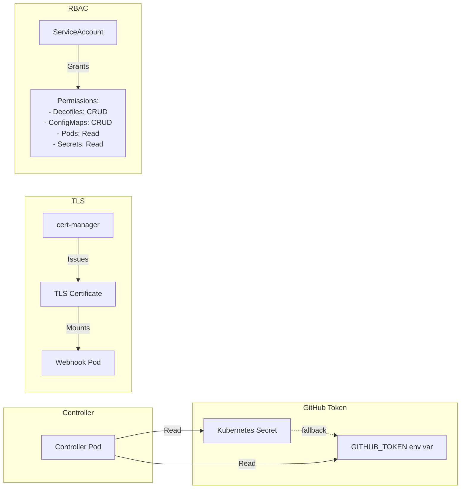
```mermaid
flowchart LR
    subgraph "GitHub Token"
        Secret[Kubernetes Secret]
        Env[GITHUB_TOKEN env var]
        Secret -.->|fallback| Env
    end
    
    subgraph "Controller"
        Ctrl[Controller Pod]
        Ctrl -->|Read| Secret
        Ctrl -->|Read| Env
    end
    
    subgraph "TLS"
        CertMgr[cert-manager]
        CertMgr -->|Issues| Cert[TLS Certificate]
        Cert -->|Mounts| Webhook[Webhook Pod]
    end
    
    subgraph "RBAC"
        SA[ServiceAccount]
        SA -->|Grants| Perms[Permissions:<br/>- Decofiles: CRUD<br/>- ConfigMaps: CRUD<br/>- Pods: Read<br/>- Secrets: Read]
    end
```

## Data Flow

```mermaid
flowchart LR
    subgraph "Sources"
        GH[GitHub Repo<br/>360 files<br/>4.2MB] -->|Download| Ctrl
        Inline[Inline JSON<br/>50KB] -->|Parse| Ctrl
    end
    
    subgraph "Operator Processing"
        Ctrl[Controller] -->|URL Decode| Clean["Campaign Timer - 01"<br/>not Campaign%20Timer]
        Clean -->|Strip Extension| Keys["config" not "config.json"]
        Keys -->|No HTML Escape| Chars["& not \u0026"]
        Chars -->|Compress if >2.5MB| Final
    end
    
    subgraph "Storage"
        Final -->|Small| CM1[decofile.json: 50KB]
        Final -->|Large| CM2[decofile.bin: 231KB]
        CM1 --> TS1[timestamp.txt]
        CM2 --> TS2[timestamp.txt]
    end
    
    subgraph "Application"
        TS1 -.->|Mount| App[Application Pod]
        TS2 -.->|Mount| App
        App -->|Read| Load{Check Extension}
        Load -->|.bin| Decompress[Decompress Brotli]
        Load -->|.json| Parse[Parse JSON]
        Decompress --> Config[Config Object]
        Parse --> Config
    end
```

## Notification Timeline


```mermaid
gantt
    title Pod Notification Timeline (50 pods)
    dateFormat X
    axisFormat %M:%S
    
    section Batch 1 (1-30)
    Pod 1-30 notification : 0, 150s
    
    section Batch 2 (31-50)
    Pod 31-50 notification : 0, 150s
    
    section Summary
    Total time : milestone, 150s
```

**With parallel batches:**
- Batches 1 & 2 run concurrently
- Total time: ~2.5 minutes for 50 pods
- All within 5-minute limit ✅

## State Machine: PodsNotified Condition

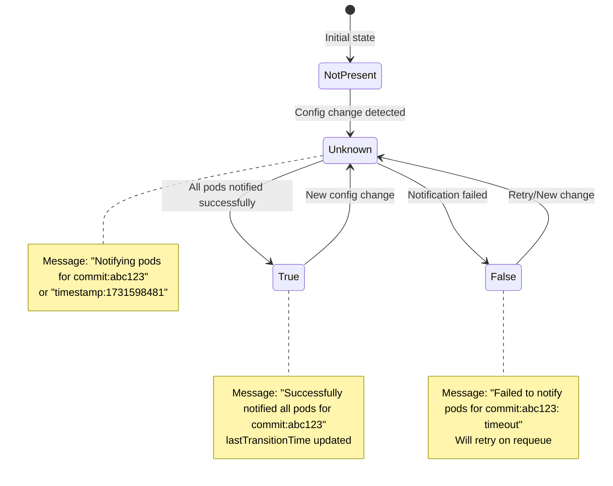
```mermaid
stateDiagram-v2
    [*] --> NotPresent: Initial state
    NotPresent --> Unknown: Config change detected
    Unknown --> True: All pods notified successfully
    Unknown --> False: Notification failed
    True --> Unknown: New config change
    False --> Unknown: Retry/New change
    
    note right of Unknown
        Message: "Notifying pods for commit:abc123"
        or "timestamp:1731598481"
    end note
    
    note right of True
        Message: "Successfully notified all pods for commit:abc123"
        lastTransitionTime updated
    end note
    
    note right of False
        Message: "Failed to notify pods for commit:abc123: timeout"
        Will retry on requeue
    end note
```

## Compression Decision Tree

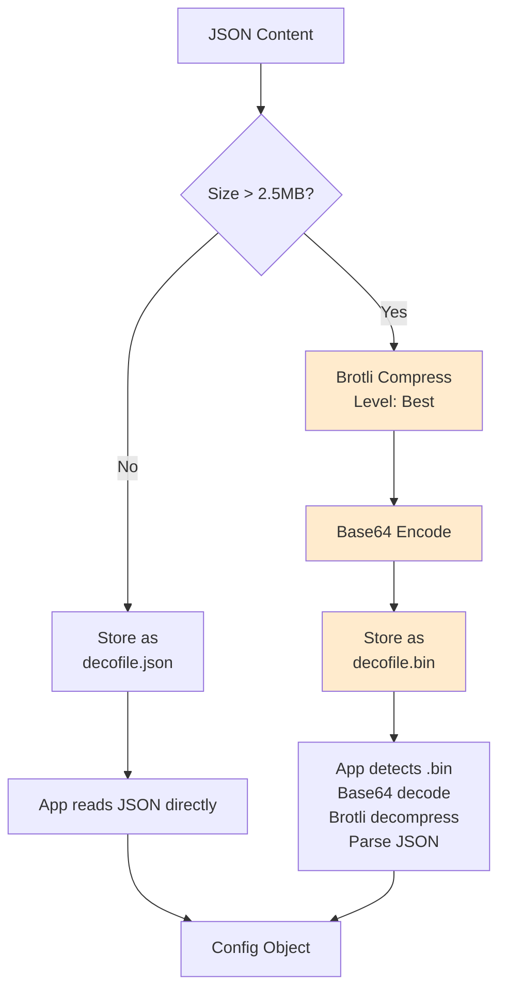
```mermaid
flowchart TD
    Start[JSON Content] --> Check{Size > 2.5MB?}
    Check -->|No| Store1[Store as<br/>decofile.json]
    Check -->|Yes| Compress[Brotli Compress<br/>Level: Best]
    Compress --> Encode[Base64 Encode]
    Encode --> Store2[Store as<br/>decofile.bin]
    Store1 --> App1[App reads JSON directly]
    Store2 --> App2[App detects .bin<br/>Base64 decode<br/>Brotli decompress<br/>Parse JSON]
    App1 --> Config[Config Object]
    App2 --> Config
    
    style Compress fill:#ffebcd
    style Encode fill:#ffebcd
    style Store2 fill:#ffebcd
```

## Silent Mode vs Normal Mode


```mermaid
flowchart TB
    subgraph "Normal Mode (silent: false)"
        N1[Config Change] --> N2[Set PodsNotified=Unknown]
        N2 --> N3[Notify Pods<br/>30 parallel]
        N3 --> N4[Wait for confirmations]
        N4 --> N5[Set PodsNotified=True<br/>with commit/timestamp]
        N5 --> N6[Clients can watch]
    end
    
    subgraph "Silent Mode (silent: true)"
        S1[Config Change] --> S2[Update ConfigMap]
        S2 --> S3[Update Status]
        S3 --> S4[No notifications]
        S4 --> S5[Pods get updates via<br/>kubelet sync ~60s]
        S5 --> S6[No PodsNotified condition]
    end
    
    style N2 fill:#d4edda
    style N5 fill:#d4edda
    style S4 fill:#e6f3ff
    style S6 fill:#e6f3ff
```

## Technology Stack

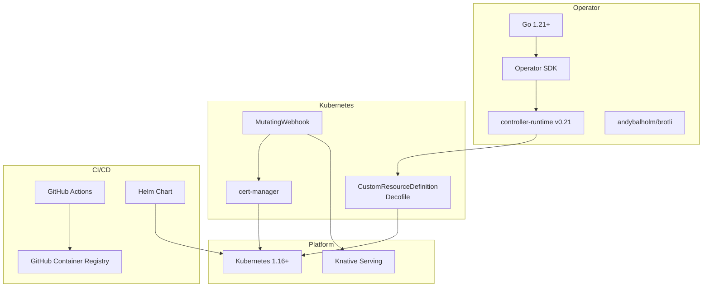
```mermaid
graph TB
    subgraph "Operator"
        Go[Go 1.21+]
        SDK[Operator SDK]
        CR[controller-runtime v0.21]
        Brotli[andybalholm/brotli]
    end
    
    subgraph "Kubernetes"
        CRD[CustomResourceDefinition<br/>Decofile]
        Webhook[MutatingWebhook]
        CertMgr[cert-manager]
    end
    
    subgraph "Platform"
        Knative[Knative Serving]
        K8s[Kubernetes 1.16+]
    end
    
    subgraph "CI/CD"
        Actions[GitHub Actions]
        GHCR[GitHub Container Registry]
        Helm[Helm Chart]
    end
    
    Go --> SDK
    SDK --> CR
    CR --> CRD
    CRD --> K8s
    Webhook --> CertMgr
    CertMgr --> K8s
    Webhook --> Knative
    Actions --> GHCR
    Helm --> K8s
```

---

## Valkey ACL Provisioning

Per-tenant cache isolation enforced at the Valkey protocol level.
Each site namespace gets a dedicated ACL user restricted to `~{site}:*` key patterns.

### Flow: Initial Provisioning

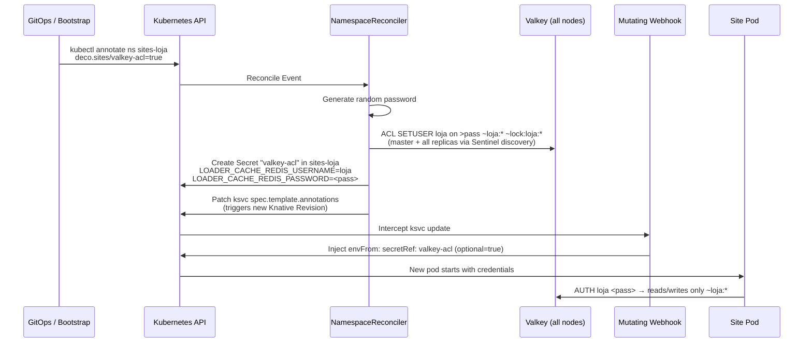
```mermaid
sequenceDiagram
    participant GitOps as GitOps / Bootstrap
    participant K8s as Kubernetes API
    participant Ctrl as NamespaceReconciler
    participant Valkey as Valkey (all nodes)
    participant Webhook as Mutating Webhook
    participant Pod as Site Pod

    GitOps->>K8s: kubectl annotate ns sites-loja<br/>deco.sites/valkey-acl=true
    K8s->>Ctrl: Reconcile Event
    Ctrl->>Ctrl: Generate random password
    Ctrl->>Valkey: ACL SETUSER loja on >pass ~loja:* ~lock:loja:*<br/>(master + all replicas via Sentinel discovery)
    Ctrl->>K8s: Create Secret "valkey-acl" in sites-loja<br/>LOADER_CACHE_REDIS_USERNAME=loja<br/>LOADER_CACHE_REDIS_PASSWORD=<pass>
    Ctrl->>K8s: Patch ksvc spec.template.annotations<br/>(triggers new Knative Revision)
    K8s->>Webhook: Intercept ksvc update
    Webhook->>K8s: Inject envFrom: secretRef: valkey-acl (optional=true)
    K8s->>Pod: New pod starts with credentials
    Pod->>Valkey: AUTH loja <pass> → reads/writes only ~loja:*
```

### Flow: Sentinel Failover Recovery

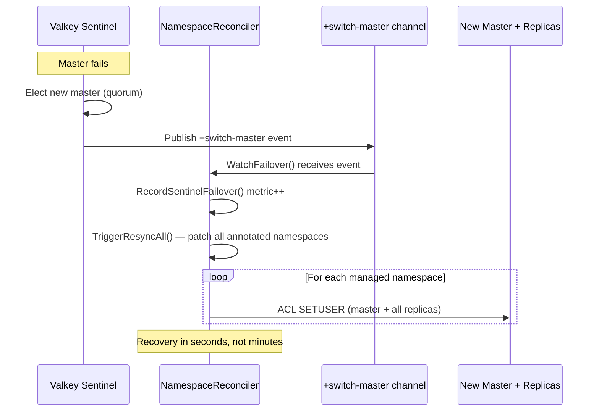
```mermaid
sequenceDiagram
    participant Sentinel as Valkey Sentinel
    participant Ctrl as NamespaceReconciler
    participant PubSub as +switch-master channel
    participant Valkey as New Master + Replicas

    Note over Sentinel: Master fails
    Sentinel->>Sentinel: Elect new master (quorum)
    Sentinel->>PubSub: Publish +switch-master event
    PubSub->>Ctrl: WatchFailover() receives event
    Ctrl->>Ctrl: RecordSentinelFailover() metric++
    Ctrl->>Ctrl: TriggerResyncAll() — patch all annotated namespaces
    loop For each managed namespace
        Ctrl->>Valkey: ACL SETUSER (master + all replicas)
    end
    Note over Ctrl: Recovery in seconds, not minutes
```

### ACL Replication Caveat

Valkey does **not** replicate `ACL SETUSER` commands to replicas.
The operator handles this by running ACL commands on every node individually:

```
UpsertUser(ctx, username, password)
  ├── ACL SETUSER on master       (via Sentinel FailoverClient)
  ├── ACL SETUSER on replica-1    (direct connection, discovered via SENTINEL REPLICAS)
  └── ACL SETUSER on replica-N
```

This ensures all nodes (master and read replicas) are always in sync,
which is required because site pods use a separate read-replica endpoint.

### Periodic Resync

The reconciler requeues every namespace on a configurable interval (default: 10min)
to ensure ACLs stay in sync after any undetected node restart.

```
VALKEY_ACL_RESYNC_PERIOD=10m  # env var or --valkey-acl-resync-period flag
```

To force immediate resync of all managed namespaces:

```bash
kubectl annotate ns -l deco.sites/valkey-acl=true \
  deco.sites/valkey-acl-sync=$(date +%s) --overwrite
```

### Metrics

| Metric | Type | Description |
|--------|------|-------------|
| `deco_operator_valkey_acl_provisioned_total` | Counter | ACL users provisioned |
| `deco_operator_valkey_acl_deleted_total` | Counter | ACL users deleted on namespace removal |
| `deco_operator_valkey_acl_errors_total{operation}` | Counter | Errors by operation (upsert/delete/check) |
| `deco_operator_valkey_acl_self_healed_total` | Counter | Re-provisions after ACL loss |
| `deco_operator_valkey_tenants_provisioned` | Gauge | Current provisioned tenants (seeded on startup) |
| `deco_operator_valkey_sentinel_failovers_total` | Counter | Sentinel +switch-master events detected |

---

## Summary

The Deco CMS Operator provides:

1. **Flexible Configuration**: Inline or GitHub sources
2. **Intelligent Compression**: Automatic Brotli for large configs
3. **Smart Caching**: Avoids redundant GitHub downloads
4. **Reliable Notifications**: Parallel, time-bounded, with retries
5. **Deterministic Updates**: Timestamp-based verification
6. **Trackable Rollouts**: Watch conditions with commit/timestamp
7. **Per-tenant Cache Isolation**: Valkey ACL per site, enforced at protocol level
8. **Production Ready**: Handles scale, failures, and edge cases

