# Deco CMS Operator Architecture

This document provides visual diagrams and architectural overview of the Deco CMS Operator.

## Complete System Flow

```mermaid
flowchart TB
    subgraph "1. Configuration Source"
        User[User/GitOps] -->|kubectl apply| Decofile[Decofile CRD]
        Decofile -->|spec.source=inline| Inline[Inline JSON]
        Decofile -->|spec.source=github| GitHub[GitHub Repository]
    end

    subgraph "2. Decofile Controller"
        Decofile --> Controller[Decofile Controller]
        Controller -->|Fetch| Inline
        Controller -->|Download ZIP| GitHub
        Controller --> Cache{Commit Changed?}
        Cache -->|No| Skip[Skip Download]
        Cache -->|Yes| Retrieve[Retrieve Content]
        Retrieve --> Size{Size > 2.5MB?}
        Size -->|Yes| Compress[Brotli Compress<br/>~5-10% ratio]
        Size -->|No| NoCompress[Keep JSON]
        Compress --> BinCM[ConfigMap<br/>decofile.bin<br/>timestamp.txt]
        NoCompress --> JsonCM[ConfigMap<br/>decofile.json<br/>timestamp.txt]
    end

    subgraph "3. Webhook Injection"
        KService[Knative Service<br/>deco.sites/decofile-inject] --> Webhook[Mutating Webhook]
        Webhook -->|Get| Decofile
        Webhook -->|Check Format| BinCM
        Webhook -->|Check Format| JsonCM
        Webhook -->|Mount Volume| PodSpec[Pod Spec]
        Webhook -->|Set DECO_RELEASE| EnvVar[file:///app/decofile/decofile.bin<br/>or .json]
        Webhook -->|Add Label| PodLabel[deco.sites/decofile: name]
    end

    subgraph "4. Change Detection & Notification"
        BinCM -.->|Watch| Controller
        JsonCM -.->|Watch| Controller
        Controller --> Changed{Content<br/>Changed?}
        Changed -->|No| Done1[Done]
        Changed -->|Yes| Silent{spec.silent?}
        Silent -->|true| SkipNotify[Skip Notifications<br/>Update Status Only]
        Silent -->|false| SetInProgress[Set Condition:<br/>PodsNotified=Unknown]
        SetInProgress --> FindPods[Find Pods by Label]
        FindPods --> Parallel[Parallel Notifications<br/>30 pods at once<br/>5 min timeout]
        Parallel -->|HTTP GET| Pod1[Pod 1<br/>/.decofile/reload]
        Parallel -->|HTTP GET| Pod2[Pod 2<br/>/.decofile/reload]
        Parallel -->|HTTP GET| PodN[Pod N<br/>/.decofile/reload]
    end

    subgraph "5. Pod Long-Polling"
        Pod1 --> LongPoll1[Poll timestamp.txt<br/>every 2s, max 120s]
        LongPoll1 --> Check1{timestamp >= expected?}
        Check1 -->|Yes| Reload1[Reload Config<br/>Return 200 OK]
        Check1 -->|No| Wait1[Wait 2s] --> LongPoll1
        
        Reload1 --> Success[All Pods Confirmed]
        Success --> UpdateCondition[Set Condition:<br/>PodsNotified=True<br/>commit:abc123]
    end

    subgraph "6. Watch Status"
        UpdateCondition -.->|Event| Watcher[Client Watcher]
        Watcher --> CheckCondition{PodsNotified<br/>== True?}
        CheckCondition -->|Yes + Commit Match| ClientSuccess[✅ Rollout Complete]
        CheckCondition -->|False| ClientFail[❌ Notification Failed]
        CheckCondition -->|Unknown| ClientWait[⏳ In Progress]
    end

    style Compress fill:#ffebcd
    style BinCM fill:#ffebcd
    style Silent fill:#e6f3ff
    style SkipNotify fill:#e6f3ff
    style UpdateCondition fill:#d4edda
    style ClientSuccess fill:#d4edda
```



## Detailed Component Flows

### Flow 1: Inline Source


### Flow 2: GitHub Source with Caching


### Flow 3: Webhook Injection


### Flow 4: Change Notification (Non-Silent)


### Flow 5: Silent Mode


### Flow 6: Watch Pattern (Race-Free)

```mermaid
sequenceDiagram
    participant Client
    participant K8s as Kubernetes API
    participant Ctrl as Controller

    Client->>K8s: Update Decofile<br/>(commit: abc123)
    Client->>K8s: GET Decofile (current state)
    K8s->>Client: Return current status
    Client->>Client: Check PodsNotified<br/>for commit:abc123
    
    alt Already Complete
        Client->>Client: ✅ Rollout done
    else Not Complete
        Client->>K8s: Start Watch
        Ctrl->>Ctrl: Process change
        Ctrl->>K8s: Update PodsNotified=Unknown
        K8s->>Client: Watch Event (Unknown)
        Ctrl->>Ctrl: Notify pods...
        Ctrl->>K8s: Update PodsNotified=True<br/>(commit:abc123)
        K8s->>Client: Watch Event (True)
        Client->>Client: ✅ Rollout confirmed
    end
```



## Key Design Decisions

### 1. Compression Strategy
- **Threshold**: 2.5MB (ConfigMap limit is 3MB)
- **Algorithm**: Brotli (best compression for JSON)
- **Ratio**: Typically 5-10% of original size
- **Example**: 4.2MB → 231KB (5.5%)
- **Storage**: Base64-encoded in `decofile.bin`
- **Detection**: Presence of `.bin` file (no flag needed)

### 2. Notification Strategy
- **Parallel**: 30 pods concurrently
- **Timeout**: 5 minutes total, 2.5 minutes per pod
- **Retries**: 2 attempts per pod
- **Long-polling**: App waits for timestamp file
- **Fresh Data**: Fetches each pod individually before notification
- **Resilient**: Handles pod churn gracefully

### 3. Timestamp System
- **Format**: Unix timestamp (seconds since epoch)
- **Purpose**: Deterministic update verification
- **Flow**: Operator → ConfigMap → Pod polls → Confirms
- **Benefit**: No guessing delays, guaranteed sync

### 4. GitHub Caching
- **Cache Key**: Commit SHA
- **Logic**: Only download if commit changed
- **Benefit**: Eliminates redundant API calls
- **Status**: Stores `GitHubCommit` in status

### 5. Condition Tracking
- **Ready**: ConfigMap created successfully
- **PodsNotified**: All pods confirmed update
- **States**: Unknown (in progress) → True/False (complete)
- **Identifier**: Includes `commit:abc123` or `timestamp:123456`
- **Reset**: Set to Unknown on each new change

## Performance Characteristics

### Small Config (< 2.5MB)
- No compression overhead
- ~200-500ms to create ConfigMap
- ~2-3 minutes for 50 pods notification

### Large Config (4MB example)
- Compression: ~4-5 seconds
- Result: 231KB (5.5% of original)
- Fits in ConfigMap easily
- Same notification time

### Parallel Notification
- 30 pods: ~2.5 minutes (1 batch)
- 60 pods: ~2.5 minutes (2 concurrent batches)
- 100 pods: ~3-4 minutes
- 150 pods: ~4-5 minutes (within limit)

## Security Model


## Data Flow

```mermaid
flowchart LR
    subgraph "Sources"
        GH[GitHub Repo<br/>360 files<br/>4.2MB] -->|Download| Ctrl
        Inline[Inline JSON<br/>50KB] -->|Parse| Ctrl
    end
    
    subgraph "Operator Processing"
        Ctrl[Controller] -->|URL Decode| Clean["Campaign Timer - 01"<br/>not Campaign%20Timer]
        Clean -->|Strip Extension| Keys["config" not "config.json"]
        Keys -->|No HTML Escape| Chars["& not \u0026"]
        Chars -->|Compress if >2.5MB| Final
    end
    
    subgraph "Storage"
        Final -->|Small| CM1[decofile.json: 50KB]
        Final -->|Large| CM2[decofile.bin: 231KB]
        CM1 --> TS1[timestamp.txt]
        CM2 --> TS2[timestamp.txt]
    end
    
    subgraph "Application"
        TS1 -.->|Mount| App[Application Pod]
        TS2 -.->|Mount| App
        App -->|Read| Load{Check Extension}
        Load -->|.bin| Decompress[Decompress Brotli]
        Load -->|.json| Parse[Parse JSON]
        Decompress --> Config[Config Object]
        Parse --> Config
    end
```

## Notification Timeline


**With parallel batches:**
- Batches 1 & 2 run concurrently
- Total time: ~2.5 minutes for 50 pods
- All within 5-minute limit ✅

## State Machine: PodsNotified Condition


## Compression Decision Tree


## Silent Mode vs Normal Mode


## Technology Stack


## Summary

The Deco CMS Operator provides:

1. **Flexible Configuration**: Inline or GitHub sources
2. **Intelligent Compression**: Automatic Brotli for large configs
3. **Smart Caching**: Avoids redundant GitHub downloads
4. **Reliable Notifications**: Parallel, time-bounded, with retries
5. **Deterministic Updates**: Timestamp-based verification
6. **Trackable Rollouts**: Watch conditions with commit/timestamp
7. **Production Ready**: Handles scale, failures, and edge cases

**All with zero configuration required from users!** 🚀

